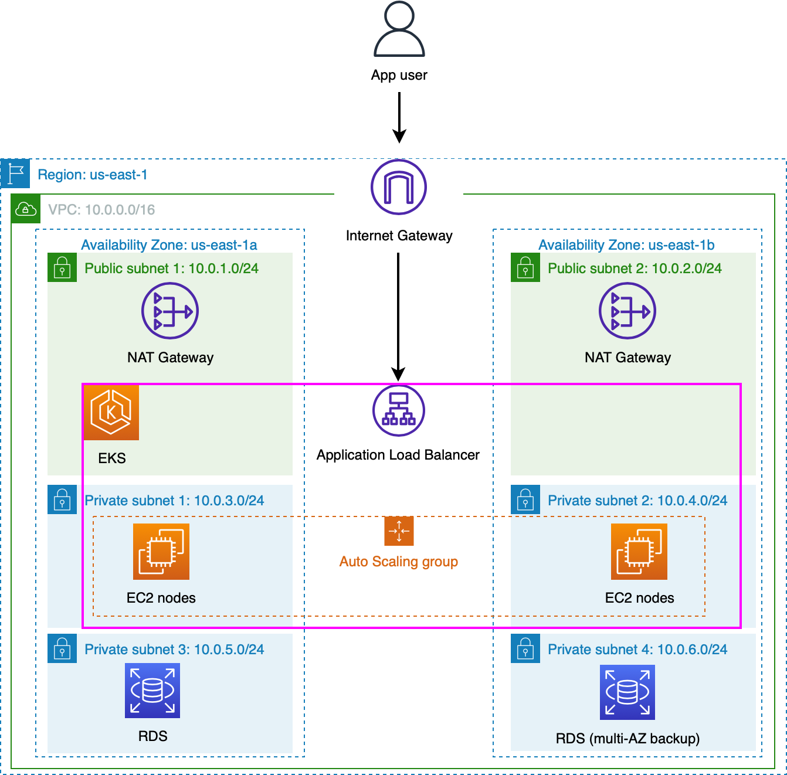
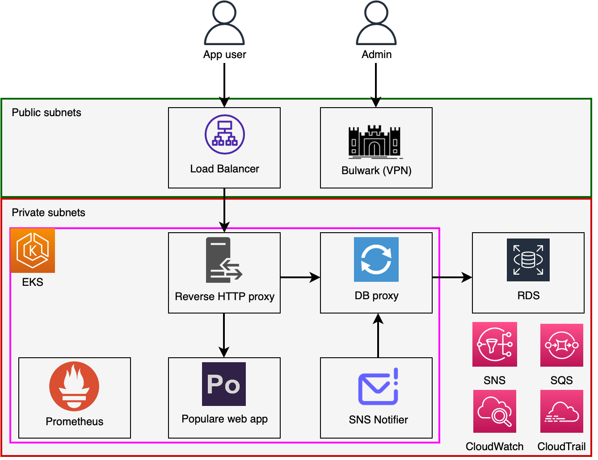

# Populare IAC

This repository defines the infrastructure for the Populare app. Running
`terraform apply` provisions compute, load balancers, databases, logging, and
other services in AWS, then deploys all Populare microservices into Kubernetes
(EKS). Once deployed, users can access the web app from the load balancer URL;
administrators can access internal services through the VPN. Running
`terraform destroy` cleans up all infrastructure. Below is the infrastructure
diagram.

## Microservices

We deploy the following microservices.

* [Populare web app](https://github.com/kostaleonard/populare)
* [Populare database proxy](https://github.com/kostaleonard/populare-db-proxy)
* [Populare reverse proxy](https://github.com/kostaleonard/populare-reverse-proxy)
* [Populare SNS notifier](https://github.com/kostaleonard/populare-sns-notifier)
* [Prometheus](https://github.com/prometheus/prometheus)
* [Wireguard](https://github.com/linuxserver/docker-wireguard)

The figure below shows how the microservices interact.

## Deployment options

1. Standalone Kubernetes. In your Kubernetes cluster (we tested with Minikube),
run `kubectl apply -f kubernetes-standalone/populare-kubernetes.yaml`. For
additional documentation, see [the Kubernetes notes page](docs/kubernetes-notes.md).
2. Terraform with AWS. Follow the instructions on [the Terraform notes page](docs/terraform-notes.md).
You will have to apply the EKS plan first, then the Kubernetes plan; this is
consistent with Terraform guides, as described in #14.

## Documentation

Please see the [docs](docs) directory for notes on specific microservices,
AWS-managed Cloud services like EKS and IAM, Terraform, and more.
